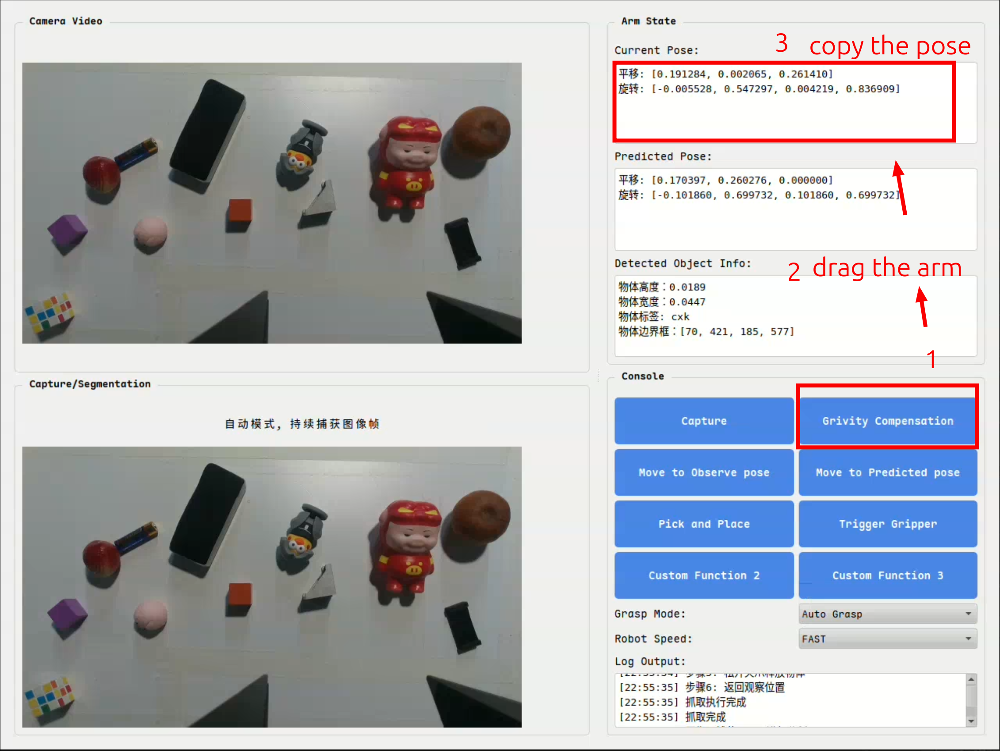
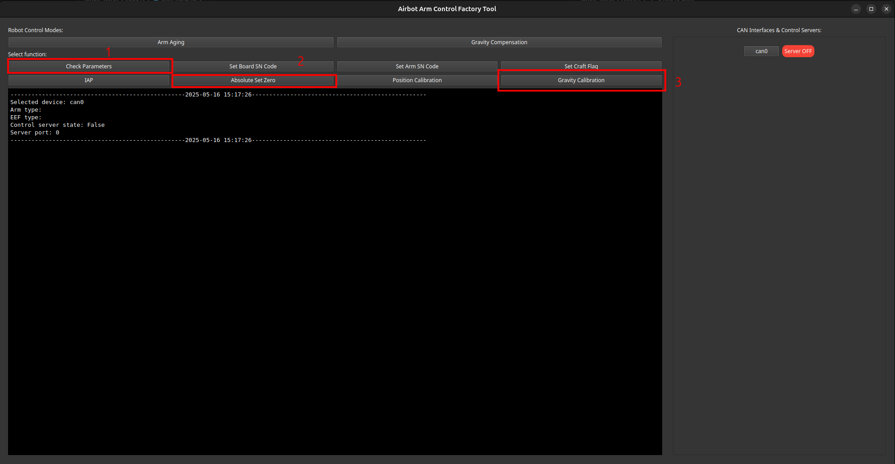
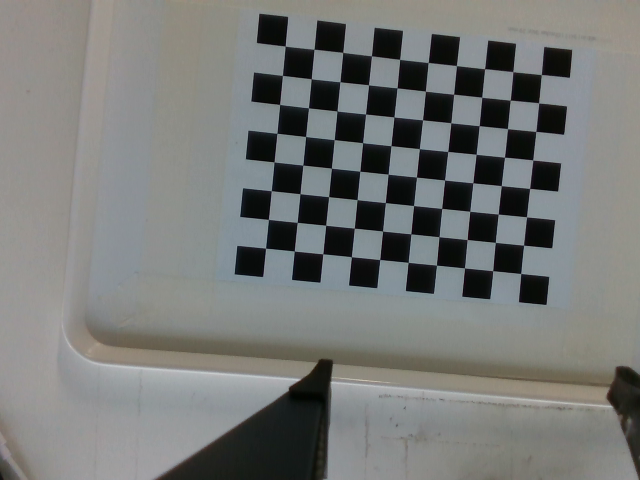
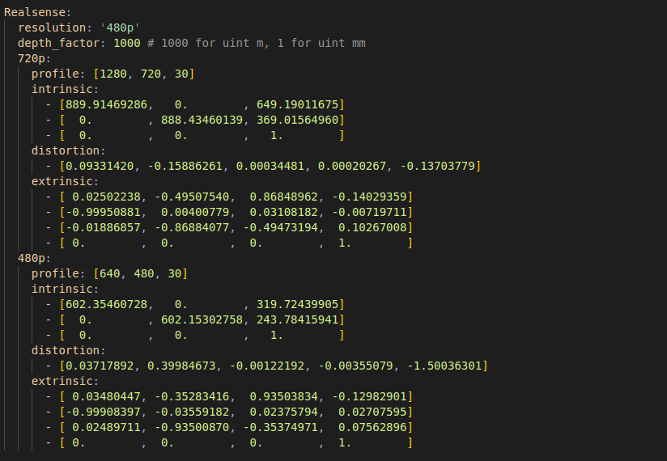

# AIRBOT Visual Grasp and Keyboard Control Demo

[English](README.md) | [中文](README.zh-CN.md)

Single-arm visual grasping with keyboard commands: standalone DISCOVERSE simulation, physical AIRBOT Play grasping, and a read-only simulation mirror of robot feedback. The pipeline includes YOLO detection, blue/green target confirmation, MobileSAM segmentation, grasp-pose estimation, and pick-and-place execution.

## Modes

| Mode | Entry point | Hardware |
| --- | --- | --- |
| Standalone simulation | `./run_keyboard.sh` | None |
| Physical robot | `./run_keyboard_robot.sh` | Real camera and AIRBOT Play |
| Robot with feedback mirror | `./run_keyboard_robot.sh --with-sim` | Real robot; simulation displays feedback |

## Simulation Quick Start

Recommended environment: Ubuntu 22.04 and Python 3.10. The keyboard installer supports Python 3.10, 3.11, and 3.12.

```bash
git clone https://github.com/DISCOVER-Robotics/AIRBOT-Keyboard-Visual-Grasp-Demo.git
cd AIRBOT-Keyboard-Visual-Grasp-Demo
./install_keyboard.sh
./run_keyboard.sh
```

The installer creates `venv-keyboard` and fetches the pinned DISCOVERSE revision. Set `GRASP_KEYBOARD_PYTHON` to reuse an existing interpreter, using the same path for installation and launch. This mode does not connect to a physical robot.

The window shows a third-person scene and a wrist-camera view. Select a target or enter a command in the right-side panel, then press Enter or click Execute. Reset the scene after pick-and-place when needed.

## Physical Robot Setup

The physical workflow uses **arm-sdk 5.2.2 and airbot-arm 5.2.2**. Place vendor packages matching Ubuntu 22.04 and your Python/platform in `packages/`:

```text
arm_sdk-5.2.2-py3-none-any.whl
airbot-arm_5.2.2_amd64.deb
```

Vendor binaries are not included. Alternative package paths are described in [packages/README.md](packages/README.md).

```bash
./install.sh
./run_keyboard_robot.sh --check
```

`--check` checks dependencies without connecting to devices. The launcher does not start the robot service automatically.

### Terminal A: Start the Robot Service

Follow the [official robot service startup guide](https://docs.discover-robotics.com/document/airbot-play/sdk/quickstart/run-service.html) to start `airbot-arm`. Refer to that guide for commands, CAN interface selection, hardware types, and service options.

Match the service settings to `ArmParams` in `configs/sam_simplegrasp.yaml`. Keep the service running before launching the physical demo in Terminal B.

### Terminal B: Launch the Physical Demo

From the repository root, with Terminal A still running:

**Starting the physical GUI automatically moves the robot to the configured observation pose.** Confirm calibration, observation/placement poses, workspace clearance, gripper settings, and emergency-stop access before startup. Committed configuration values are workstation-specific, not universally safe defaults.

```bash
./run_keyboard_robot.sh
```

Use the keyboard-grasp tab to enter commands. `./run_grasp.sh` launches the same physical keyboard interface. Manual image selection and control-connection recovery remain available.

### Interface and Workspace References

The original interface screenshot below illustrates camera views and pose information. It is a historical reference, not a screenshot of the current keyboard interface.



The original workspace illustration is shown below. Determine the actual safe working area from your robot, camera mounting, and surrounding obstacles.



## Commands

| Command | Action |
| --- | --- |
| `抓取蓝色积木` / `抓取绿色积木` | Confirm and grasp the requested block color |
| `打开夹爪` | Open the gripper |
| `闭合夹爪` / `关闭夹爪` | Close the gripper |
| `回到观察位` | Move to the observation pose |
| `拍照` | Capture a fresh view |
| `预测位姿` | Estimate the grasp pose without executing a grasp |
| `开始抓取` | Grasp the prepared target |

Commands are subject to target confirmation and busy-state checks. Enter and the confirmation button use the same dispatch path.

## Feedback Mirror

Install optional simulation dependencies in the physical workflow's environment:

```bash
./install_sim.sh
./run_keyboard_robot.sh --with-sim
```

The mirror is read-only; the physical GUI still controls the robot. `./run_sim.sh` launches standalone keyboard simulation in the shared environment.

The physical feedback-mirror mode also requires the service in Terminal A to remain running. Close the physical GUI and mirror before stopping the service; refer to the official guide for shutdown behavior and options.

To reuse an existing environment, set `GRASP_KEYBOARD_PYTHON=/path/to/venv/bin/python` for the physical launcher. Set `GRASP_SIM_PYTHON` when installing simulation dependencies into that environment.

## Configuration and Safety

### Hand-Eye Calibration

Recalibrate after changing the camera, mounting position, or image resolution. The original calibration capture example is shown below:



Write the measured intrinsics, distortion coefficients, and camera-to-end-effector transform into the matching resolution section of `configs/sam_simplegrasp.yaml`. Values in the original result screenshot are examples, not calibration values for your robot.



### Workstation Configuration

- `configs/config_file.yaml` selects `configs/sam_simplegrasp.yaml` for the physical workflow.
- `configs/sam_simplegrasp.yaml` contains models, calibration, connection settings, observation/placement poses, and motion protections. Recalibrate for your workstation.
- `configs/live_mirror.yaml` controls the feedback mirror.
- Use RealSense or configure and calibrate USB RGB mode. RGB mode assumes a fixed camera and measured table plane.
- Keyboard commands are not a hardware emergency stop. Keep people and obstacles outside the robot workspace.

## Repository Layout

```text
app/              Vision, calibration, robot control, keyboard UI, simulation
configs/          Physical and simulation configurations
checkpoint/       YOLO and segmentation weights
packages/         Vendor package instructions; binaries supplied separately
tests/            Offline regression tests
```

## Upstream Components

DISCOVERSE is fetched at the revision specified in the installers. Review the licenses of DISCOVERSE, YOLO/Ultralytics, MobileSAM, MuJoCo, vendor packages, and all models before redistribution or commercial use.
