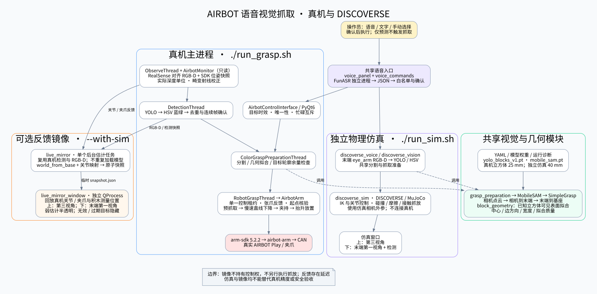

# AIRBOT 语音视觉抓取软件架构



[可编辑 DOT 源图](../assets/voice_grasp_architecture.dot) · [PNG 图片](../assets/voice_grasp_architecture.png) · [使用说明](../README.md) · [版本变化](../CHANGELOG.md)

## 三种运行方式

| 入口 | 运动执行 | 图像与场景来源 |
| --- | --- | --- |
| `./run_grasp.sh` | SDK 驱动真机 | RealSense RGB-D；也支持固定桌面的 USB RGB 模式 |
| `./run_grasp.sh --with-sim` | 同一真机控制链路 | 主窗口显示实拍；独立镜像窗口显示真机反馈与测得的积木位置 |
| `./run_sim.sh` | MuJoCo 独立物理抓放 | 仿真末端 `eye_arm` 相机；不连接真实机械臂 |

两个仿真窗口均采用上方第三视角、下方末端第一视角的布局。镜像通过反馈跟随真机，并非两套控制器同时执行语音轨迹。

## 真机数据与控制链路

1. `voice_panel.py` 通过 QProcess 调用常驻 `voice_asr_worker.py`，本地 FunASR 将录音转成 JSON 文本。`voice_commands.py` 做白名单、错词校正及确认规则处理；文字输入使用同一入口。
2. `airbot_interface.py` 的观察线程采集图像及只读 SDK 状态，保存带时间信息的快照。检测线程执行 `airbot_yolo.py`：YOLO 定位、HSV 蓝绿分类、同色重叠框去重和连续帧确认。
3. 唯一且新鲜的目标送入准备线程，通过 `grasp_preparation.py` 调用 MobileSAM、`airbot_grasp_simple.py`。`camera_geometry.py` 使用匹配分辨率的内参和畸变参数生成点云，经相机到末端、末端到基座变换得到基座点云。
4. `block_geometry.py` 拟合已知尺寸立方体的有限可见表面，估计中心、边方向和宽度，并检查拟合质量与歧义。真机当前尺寸为 25 mm。实时颜色自动抓取还检查目标点到分割轮廓的余量；`grasp_preview.py` 提供不运动的预测图。
5. 抓取线程通过 `airbot_arm.py` 的唯一持租约客户端执行抓放。下降前验证夹爪开度和预抓取起点，限制直线下降速度；接触确认后才继续搬运。控制租约失效或起点不匹配时中止后续动作，不自动重放。

RealSense 深度对齐到原始彩色像素，使用设备实际深度比例、不补洞。畸变校正作用于反投影射线，避免图像、掩码与深度索引错位。快照配对与时效检查不等于相机和 SDK 的硬件同步。

## 进程、线程与资源

| 模块 | 执行位置与职责 |
| --- | --- |
| PyQt6 主界面 | 主线程负责交互、显示与任务调度 |
| Observe / Detection / ColorGraspPreparation / RobotGrasp | 分别处理观察、检测、抓取准备及运动；实时检测处理最新帧 |
| FunASR worker | 常驻独立进程，避免重复加载语音模型 |
| `live_mirror.py` | 主程序桥接；单个后台场景估计任务，忙碌时不堆积检测任务；原子发布临时快照 |
| `live_mirror_window.py` | 独立渲染进程；读取最新反馈，不持有真机控制租约 |
| `discoverse_voice.py` | 独立仿真 GUI；视觉准备在后台，MuJoCo 与渲染在主线程 |
| YAML 与权重 | `sam_simplegrasp.yaml` 保存真实标定、位姿、模型及几何参数；仿真和镜像各自使用专用配置 |

## 仿真与镜像适配

独立仿真复用语音面板、YOLO/HSV、MobileSAM 和 `prepare_color_grasp`，以 `discoverse_vision.py` 适配末端相机 RGB-D。外参由仿真相机和末端变换计算；积木尺寸为 40 mm，工具长度和最低高度由 `configs/discoverse_sim.yaml` 定义。`discoverse_sim.py` 通过 IK、关节控制和实际碰撞/摩擦执行抓放，夹持反馈不等价于真机电机反馈。

镜像复用真机已有检测和 RGB-D，不启动第二套 YOLO/SAM。`configs/live_mirror.yaml` 定义 `world_from_base`、关节方向/零位、25 mm 实物尺寸和超时规则。完整顶面测量显示实色积木，较弱的可见点估计显示半透明积木；同色歧义、无效或过期数据隐藏。镜像估计与完整抓取几何拟合是不同用途的链路，不能把镜像位置当作独立定位真值。

## 设计边界

- 默认人工确认；语音只映射固定命令，不生成 Python、shell 或任意 SDK 调用。
- 多个同色目标、过期快照、无效深度或失败预测不启动颜色抓取；忙碌时拒绝新语音任务，不排队。
- 观察客户端只读，镜像不申请控制权；失去控制后需显式恢复连接并重新确认任务。
- GUI 启动时会自动移动到观察位；“仅预测”只表示该按钮本身不发送运动。
- 取消录音不是机械臂急停；硬件急停位于软件链路之外。
- USB RGB 模式依赖固定桌面假设，不提供真实深度，不能承担镜像中的 RGB-D 位置同步。
- 镜像含采样与渲染延迟；场景对齐、动力学、光照及噪声未完成全面现场验证，不能作为真机精度或安全验收标准。

## 重新生成图

在仓库根目录安装好 Graphviz 后运行：

```bash
dot -Tsvg assets/voice_grasp_architecture.dot -o assets/voice_grasp_architecture.svg
dot -Tpng -Gdpi=160 assets/voice_grasp_architecture.dot -o assets/voice_grasp_architecture.png
```
